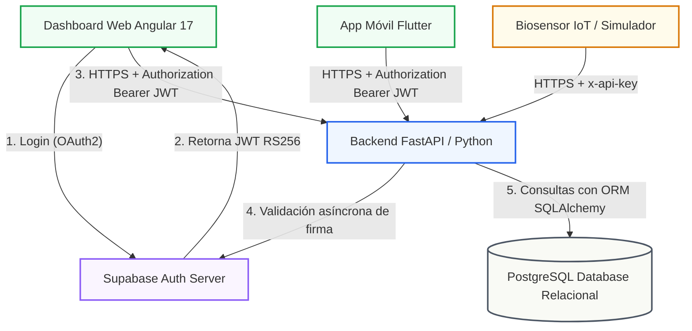

# PLAN DE DESARROLLO E INTEGRACIÓN DE COMPONENTES DE SOFTWARE
### UNIVERSIDAD TECNOLÓGICA DEL CENTRO DE VERACRUZ (UTCV)
**Área:** Tecnologías de la Información — Desarrollo de Software Multiplataforma  
**Proyecto Integrador:** AsmaSync (Ecosistema de Monitoreo Clínico y Predicción del Asma)  
**Materia:** Saber Hacer Producto (SHP) — Segundo Parcial  
**Ubicación:** Cuitláhuac, Veracruz, México  
**Estatus:** Aprobado para Integración  

---

## 🔍 1. INTRODUCCIÓN Y ARQUITECTURA DE INTEGRACIÓN EN LA UTCV

Este plan de desarrollo e integración define formalmente la arquitectura, protocolos y directrices de seguridad para el ecosistema **AsmaSync**, un sistema médico inteligente diseñado en la **Universidad Tecnológica del Centro de Veracruz (UTCV)**. La plataforma tiene como propósito la recopilación automatizada de signos vitales (oximetría de pulso SpO2 y Flujo Espiratorio Máximo PEF) mediante sensores IoT y simuladores de hardware, permitiendo que un algoritmo de Machine Learning (Scikit-Learn) clasifique el nivel de riesgo de crisis del paciente y notifique de inmediato a los médicos y tutores a través de una aplicación web y móvil.

La integración del ecosistema contempla:
*   **Cliente Web (Dashboard del Médico):** Desarrollado sobre **Angular 17** usando inyección de dependencias avanzada, TypeScript en modo estricto y RxJS.
*   **Cliente Móvil (Aplicación del Paciente):** Desarrollada en **Flutter/Dart** para visualizaciones en tiempo real y conectividad con biosensores.
*   **Servidor Backend (FastAPI Web Service):** API Gateway y motor asíncrono en **Python 3.12** que orquesta la persistencia en base relacional y la inferencia de Inteligencia Artificial.
*   **Servicios en la Nube:** Proveedor de identidad delegada **Supabase Auth** y base de datos relacional hospedada en PostgreSQL.

### Diagrama Arquitectónico de Interoperabilidad en AsmaSync
El siguiente diagrama detalla el flujo de información segura e integración de los componentes:



---

## 🔒 2. MECANISMOS DE SEGURIDAD INTEGRADOS

El aseguramiento de datos de salud confidenciales (PHI) exige la adopción de controles alineados con la NOM-004-SSA3-2012 (Expediente Clínico Electrónico en México) y estándares internacionales como HIPAA:

### A. Validación de Entradas (Input Validation)
*   **Frontend (Angular):** Sanitización contra inyecciones SQL (SQLi) y Cross-Site Scripting (XSS) en todos los campos de formularios reactivos del médico y paciente.
    *   *Filtro Reactivo:* [`no-sql-injection.validator.ts`](file:///c:/asmasync-dashboard/frontend/src/app/shared/validators/no-sql-injection.validator.ts) valida de forma estricta los caracteres de entrada:
    ```typescript
    import { AbstractControl, ValidationErrors, ValidatorFn } from '@angular/forms';

    export function noSqlInjectionValidator(): ValidatorFn {
        return (control: AbstractControl): ValidationErrors | null => {
            if (!control.value) return null;
            const sqlPattern = /(')|(--)|(;)|(\/\*)|(xp_)/i;
            const xssPattern = /<script|onerror\s*=|javascript:|<iframe|onload\s*=/i;
            const hasInjection = sqlPattern.test(control.value) || xssPattern.test(control.value);
            return hasInjection ? { sqlInjection: true } : null;
        };
    }
    ```
*   **Backend (FastAPI + Pydantic v2):** Conversión y validación de tipos asíncronos mediante esquemas Pydantic que fuerzan la validación estricta de las variables de salud (oximetría de pulso SpO2 y PEF) antes de interactuar con PostgreSQL.
    ```python
    from pydantic import BaseModel, field_validator
    from typing import Optional
    from datetime import datetime

    class SpirometerRequest(BaseModel):
        pef: int
        fev1: Optional[float] = None
        measured_at: datetime

        @field_validator("pef")
        @classmethod
        def validate_pef(cls, v):
            if not (0 <= v <= 900):
                raise ValueError("Flujo Espiratorio Máximo fuera de rango fisiológico tolerable (0 - 900 L/min)")
            return v
    ```

### B. Autenticación y Autorización
*   **Identidad Delegada (IDaaS):** El sistema delega la capa de identidad a **Supabase Auth**. Al iniciar sesión, el usuario recibe un token JWT firmado criptográficamente con algoritmo RS256/HS256. El backend de FastAPI intercepta e inspecciona el token en cada llamada.
*   **Control de Acceso basado en Roles (RBAC):** Se implementa control de accesos jerárquicos sobre las rutas sensibles. Por ejemplo, la creación y edición de expedientes clínicos requiere permisos del rol `doctor` o `admin`:
    ```python
    def verify_admin_role(
        x_dashboard_api_key: Optional[str] = Header(None),
        token_data: dict = Depends(verify_supabase_token),
    ):
        if x_dashboard_api_key and x_dashboard_api_key == settings.dashboard_api_key:
            return {"is_admin": True}
        # Validación de rol de Postgres
        if token_data.get("role") != "admin":
            raise HTTPException(status_code=403, detail="Permisos insuficientes.")
    ```

### C. Manejo Seguro de Contraseñas
*   **Cifrado de Credenciales:** El backend de Supabase almacena las contraseñas aplicando hashing adaptativo **Bcrypt** con salt dinámico, protegiendo las cuentas frente a ataques de fuerza bruta y colisiones.
*   **Almacenamiento Local Cifrado:** Para evitar la lectura de tokens en texto plano desde herramientas de desarrollo, se implementa el servicio [`StorageService`](file:///c:/asmasync-dashboard/frontend/src/app/core/services/storage.service.ts) en Angular, que utiliza cifrado **AES-256** mediante la librería **CryptoJS**:
    ```typescript
    setItem(key: string, value: any): void {
        const json = JSON.stringify(value);
        const encrypted = CryptoJS.AES.encrypt(json, this.SECRET_KEY).toString();
        localStorage.setItem(key, encrypted);
    }
    ```

### D. Mínimo Privilegio (Principle of Least Privilege)
*   **Credenciales de Base de Datos:** La cadena de conexión de SQLAlchemy utiliza un rol restringido que posee permisos exclusivos de CRUD sobre el esquema de datos clínico, inhabilitando operaciones administrativas sobre la base de datos PostgreSQL global.
*   **Validación de Propiedad de Recursos:** FastAPI valida de forma lógica que el `supabase_uid` extraído del token JWT corresponda al propietario de los datos de salud solicitados, impidiendo accesos cruzados no autorizados.

### E. Manejo de Errores y Excepciones
*   **Ocultamiento de Metadatos:** El backend FastAPI implementa un middleware de captura global de excepciones. De este modo, los fallos internos o de conexión de base de datos no exponen trazas de pila (stack traces), nombres de columnas o dependencias internas, devolviendo en su lugar un código HTTP estandarizado con un mensaje limpio para el cliente.
    ```python
    from fastapi import Request
    from fastapi.responses import JSONResponse
    from sqlalchemy.exc import SQLAlchemyError

    @app.exception_handler(SQLAlchemyError)
    async def database_exception_handler(request: Request, exc: SQLAlchemyError):
        # Log del error interno (invisble al cliente)
        logger.error(f"Error de base de datos detectado: {str(exc)}")
        return JSONResponse(
            status_code=400,
            content={"detail": "La transacción de base de datos no pudo ser procesada."}
        )
    ```

### F. Actualización Constante
*   **Control de Versiones de Dependencias:** Registro estricto de librerías críticas en [`requirements.txt`](file:///c:/asmasync-dashboard/backend/requirements.txt) y congelación de paquetes en `package-lock.json` en el cliente web, reduciendo la exposición ante vulnerabilidades de la cadena de suministro.

### G. Uso de Conexiones Seguras (TLS y Certificados)
*   **Canal Seguro HTTPS:** Cifrado forzado por HTTPS con soporte exclusivo de **TLS 1.3** en Render y Supabase.
*   **Prevención de Fuga de Tokens:** El interceptor de Angular analiza el host destino, inyectando la cabecera `Authorization: Bearer` únicamente en peticiones destinadas a la API oficial de AsmaSync, previniendo la fuga involuntaria de tokens a servidores de terceros.

---

## 🌐 3. CATÁLOGO DE WEB SERVICES, PROTOCOLOS Y FORMATOS DE DATOS

La comunicación entre el cliente (Angular / Flutter) y el servidor (FastAPI) se efectúa de manera síncrona mediante el protocolo **REST** sobre HTTPS y de manera asíncrona mediante **WebSockets** sobre HTTPS para telemetría y alertas clínicas en tiempo real. El formato de intercambio estandarizado es **JSON (application/json)** para todos los servicios de datos, y **application/pdf** para reportes descargables.

### A. Estructuras de Datos JSON y payloads de Entrada/Salida

#### 1) POST `/api/auth/register` (Registro de Usuario)
*   **Entrada (JSON):**
    ```json
    {
      "email": "paciente.ejemplo@utcv.edu.mx",
      "password": "PasswordSegura99!",
      "role": "patient",
      "full_name": "Juan Pérez Gómez"
    }
    ```
*   **Salida Exitosa (JSON - HTTP 201 Created):**
    ```json
    {
      "id": 14,
      "email": "paciente.ejemplo@utcv.edu.mx",
      "role": "patient",
      "created_at": "2026-07-16T12:00:00Z"
    }
    ```

#### 2) POST `/api/auth/login` (Autenticación e inicio de sesión)
*   **Entrada (JSON):**
    ```json
    {
      "email": "paciente.ejemplo@utcv.edu.mx",
      "password": "PasswordSegura99!"
    }
    ```
*   **Salida Exitosa (JSON - HTTP 200 OK):**
    ```json
    {
      "access_token": "eyJhbGciOiJIUzI1NiIsInR5cCI6IkpXVCJ9...",
      "token_type": "bearer",
      "expires_in": 3600
    }
    ```

#### 3) POST `/api/measurements` (Ingesta de Oximetría y PEF)
*   **Entrada (JSON) [Cabecera `Authorization: Bearer <JWT>`]:**
    ```json
    {
      "patient_id": 14,
      "spo2": 95,
      "pef": 420,
      "measured_at": "2026-07-16T12:00:00Z"
    }
    ```
*   **Salida Exitosa (JSON - HTTP 201 Created):**
    ```json
    {
      "measurement_id": 2045,
      "patient_id": 14,
      "spo2": 95,
      "pef": 420,
      "risk_level": "green",
      "timestamp": "2026-07-16T12:00:00Z"
    }
    ```

#### 4) POST `/api/predictor/risk` (Clasificación del Modelo de Machine Learning)
*   **Entrada (JSON) [Cabecera `Authorization: Bearer <JWT>`]:**
    ```json
    {
      "pef": 310,
      "spo2": 88,
      "symptoms_severity": "severe"
    }
    ```
*   **Salida Exitosa (JSON - HTTP 200 OK):**
    ```json
    {
      "predicted_risk": "red",
      "accuracy_validated": 0.924,
      "clinical_recommendation": "Alerta crítica de asma. Administre inhalador de rescate y consulte urgencias."
    }
    ```

---

### B. Catálogo General de Endpoints RESTful y WebSockets

| Módulo / Recurso | Método HTTP | Endpoint del Web Service | Parámetros / Cargas Útiles | Salidas (Formato de Éxito) |
| :--- | :--- | :--- | :--- | :--- |
| **Autenticación** | `GET` | `/api/auth/check-email` | Query: `email` (string) | JSON: `{"available": true}` |
| **Autenticación** | `POST` | `/api/auth/register` | JSON body: email, password, role | JSON: user profile (HTTP 201) |
| **Autenticación** | `POST` | `/api/auth/login` | JSON body: email, password | JSON: access_token JWT (HTTP 200) |
| **Mediciones IoT** | `POST` | `/api/measurements` | JSON: patient_id, spo2, pef | JSON: measurement data (HTTP 201) |
| **Mediciones IoT** | `GET` | `/api/measurements/patient/{id}` | URL Param: id (int) | JSON: array of readings (HTTP 200) |
| **Mediciones IoT** | `POST` | `/api/measurements/spirometer/simulate` | x-api-key + JSON: email, pef | JSON: success status (HTTP 201) |
| **IA / Predicción** | `POST` | `/api/predictor/risk` | JSON: pef, spo2, symptoms | JSON: predicted_risk (HTTP 200) |
| **Pacientes** | `POST` | `/api/patients` | JSON: first_name, birth_date | JSON: patient_id (HTTP 201) |
| **Pacientes** | `GET` | `/api/patients/{id}` | URL Param: id (int) | JSON: patient data (HTTP 200) |
| **Pacientes** | `PUT` | `/api/patients/{id}` | JSON: first_name, phone | JSON: update status (HTTP 200) |
| **Pacientes** | `DELETE` | `/api/patients/{id}` | URL Param: id (int) | HTTP 204 No Content |
| **Reportes PDF** | `GET` | `/api/reports/patient/{id}/pdf` | URL Param: id (int) | Binary: application/pdf (HTTP 200) |
| **Alertas en Vivo** | `GET` | `/api/alerts` | Query: is_viewed, limit | JSON: array of alerts (HTTP 200) |

---

## 🔑 4. ESQUEMAS DE AUTENTICACIÓN REMOTA DE WEB SERVICES

Para dar cobertura a los distintos clientes y nodos de hardware del ecosistema de salud, se implementan de forma paralela tres esquemas de autenticación remota:

### Esquema 1: Tokens JWT Criptográficos (Supabase Auth)
*   **Justificación:** Estándar moderno *stateless* ideal para aplicaciones Web (Angular) y Móviles (Flutter). Evita que el servidor guarde sesiones activas en memoria, facilitando la escalabilidad.
*   **Configuración en Servidor (FastAPI):** Se integra el SDK oficial de Supabase. El enrutador intercepta la cabecera `Authorization`, extrae el Bearer token y valida su validez criptográfica:
    ```python
    # Verificador del token JWT en el backend FastAPI
    def verify_supabase_token(token: str = Depends(oauth2_scheme)) -> dict:
        try:
            user_response = supabase.auth.get_user(token)
            return {"supabase_uid": user_response.user.id, "email": user_response.user.email}
        except Exception:
            raise HTTPException(status_code=401, detail="Token JWT inválido o expirado")
    ```
*   **Configuración en Cliente (Angular):** Se utiliza un interceptor HTTP (`AuthInterceptor`) que inyecta automáticamente la cabecera en peticiones dirigidas al backend local:
    ```typescript
    // Inyección automatizada del token en las cabeceras HTTP de Angular 17
    const token = this.authService.getToken();
    if (token) {
        request = request.clone({
            setHeaders: { Authorization: `Bearer ${token}` }
        });
    }
    ```

### Esquema 2: Cabecera Estática Personalizada (Dashboard API Key)
*   **Justificación:** Interacción programada y sincronización de servidor a servidor (Machine-to-Machine) entre el Dashboard Hospitalario centralizado y la API de AsmaSync sin requerir sesión interactiva.
*   **Configuración en Servidor:** El enrutador verifica la presencia de la cabecera personalizada `x-dashboard-api-key`. Si coincide con la clave secreta guardada de forma segura en las variables de entorno del servidor, otorga los privilegios necesarios de lectura y administración global:
    ```python
    # Middleware de verificación M2M por llave estática en FastAPI
    def verify_admin_role(x_dashboard_api_key: Optional[str] = Header(None)):
        if x_dashboard_api_key and x_dashboard_api_key == settings.dashboard_api_key:
            return {"auth_method": "api_key", "is_admin": True}
    ```

### Esquema 3: Clave de Ingesta IoT (Pre-Shared Key)
*   **Justificación:** Los microcontroladores embebidos en el hardware del espirómetro poseen limitados recursos computacionales y memoria. Establecer negociaciones de tokens JWT y renovación asíncrona es ineficiente en firmware. Se implementa una llave estática pre-compartida (PSK) en el canal de ingesta rápida.
*   **Configuración en Servidor:** La ruta especializada `/api/measurements/spirometer/simulate` valida el header `x-api-key: ClaveSecretaParaMaestros`. Si es correcta, procesa e inserta la telemetría asignando el registro al paciente según su correo electrónico:
    ```python
    # Endpoint de simulación embebido de telemetría IoT
    @router.post("/spirometer/simulate")
    async def simulate_spirometer(data: SimulatorRequest, x_api_key: str = Header(None)):
        if x_api_key != "ClaveSecretaParaMaestros":
            raise HTTPException(status_code=403, detail="Sensor no autorizado")
        # ... procesar soplido ...
    ```
