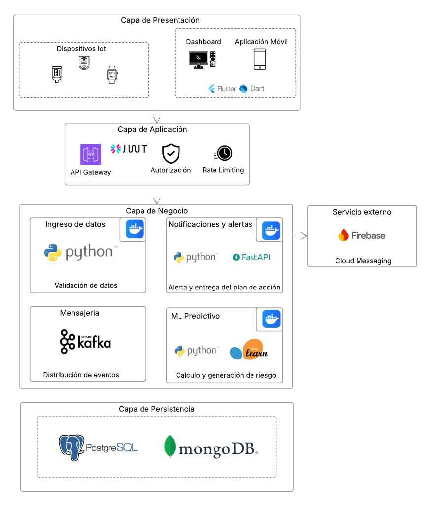
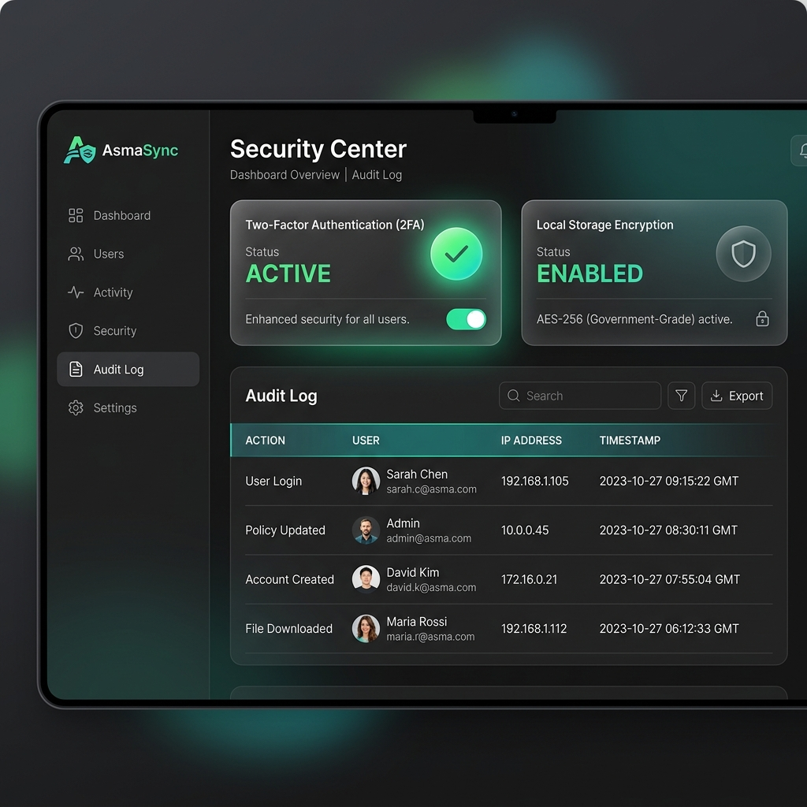

# Plan de Implementación de Mecanismos de Seguridad — AsmaSync

**Proyecto Integrador:** AsmaSync (Monitoreo y Predicción del Asma)  
**Autor:** Antigravity (Asistente de Desarrollo Segurizado)  
**Entorno:** Angular 17 · FastAPI · SQLAlchemy · PostgreSQL · Supabase Auth  
**Ubicación de Reporte:** `ProyInt/Plan_Implementacion_Seguridad.md`

---

## 🔍 Resumen Ejecutivo

Este documento detalla el **Plan de Implementación de Mecanismos de Seguridad** para el proyecto integrador **AsmaSync**, diseñado para proteger la información de salud sensible de los pacientes (datos clínicos, SpO2, PEF y perfiles médicos) y asegurar el control de acceso en el ecosistema IoT y web.

El plan cubre las 7 áreas clave de la codificación segura, alineándose con las mejores prácticas de la industria y la mitigación de amenazas basada en el modelo **STRIDE**.

---

## 🗺️ Arquitectura de Seguridad de AsmaSync

El siguiente diagrama detalla el flujo de datos seguro implementado entre el cliente web (Angular), el proveedor de identidad delegada (Supabase Auth) y el servidor backend (FastAPI + PostgreSQL):



---

## 🛠️ Desarrollo de Puntos del Plan de Seguridad

### 1. Validación de Entradas (Input Validation)
La validación de entradas evita que datos maliciosos (cargas útiles de inyección SQL, XSS o valores fuera del rango fisiológico) comprometan el backend o la experiencia del usuario.

*   **Validación en Frontend (Angular):**
    Se implementan validadores reactivos contra inyecciones SQL/XSS en campos de texto y validadores de rango clínico para variables de salud (SpO2, PEF) para rechazar outliers de sensores IoT.
*   **Validación en Backend (FastAPI + Pydantic):**
    FastAPI usa esquemas Pydantic que realizan coerciones y validaciones de tipos estrictas antes de interactuar con el ORM.

#### Evidencia de Código (Frontend - Validador de Inyección y XSS)
[`no-sql-injection.validator.ts`](file:///c:/asmasync-dashboard/frontend/src/app/shared/validators/no-sql-injection.validator.ts)
```typescript
import { AbstractControl, ValidationErrors, ValidatorFn } from '@angular/forms';

export function noSqlInjectionValidator(): ValidatorFn {
    return (control: AbstractControl): ValidationErrors | null => {
        if (!control.value) {
            return null;
        }

        // Patrones SQL comunes: ' OR, --, ;, /*, xp_
        const sqlPattern = /(')|(--)|(;)|(\/\*)|(xp_)/i;
        // Patrones XSS comunes: <script, onerror, javascript:, <iframe, onload
        const xssPattern = /<script|onerror\s*=|javascript:|<iframe|onload\s*=|= 50 && value <= 100;
  }

  /**
   * Valida Flujo Espiratorio Máximo (PEF).
   * Valores superiores a 900 se consideran outliers del sensor.
   */
  static isPEFValid(value: number): boolean {
    return value >= 0 && value <= 900;
  }
}
```

#### Evidencia de Código (Backend - Esquema de Entrada Pydantic)
[`measurement_schemas.py`](file:///c:/asmasync-dashboard/backend/app/asthma-predictor-api/app/domain/schemas/measurement_schemas.py)
```python
from pydantic import BaseModel, field_validator
from datetime import datetime, timezone
from typing import Optional

class SpirometerRequest(BaseModel):
    """Datos validados del espirómetro recibidos por la API"""
    pef: int  # Peak Expiratory Flow
    fev1: Optional[float] = None
    symptoms: Optional[str] = None
    symptom_intensity: Optional[str] = None  # Leve / Moderada / Severa
    measured_at: datetime

    @field_validator("measured_at", mode="after")
    @classmethod
    def normalize_timezone(cls, v: datetime) -> datetime:
        if v.tzinfo is not None:
            return v.astimezone(timezone.utc).replace(tzinfo=None)
        return v
```

---

### 2. Autenticación y Autorización (Authentication & Authorization)
La autenticación valida la identidad de un usuario, mientras que la autorización define sus permisos dentro del sistema (RBAC - Control de Acceso Basado en Roles).

*   **Autenticación Criptográfica:**
    Se delega la emisión de tokens JWT a **Supabase Auth**. El backend verifica la firma y el vencimiento de cada JWT consultando a Supabase mediante su SDK.
*   **Autorización RBAC en Backend:**
    FastAPI usa dependencias jerárquicas para proteger las rutas. Rutas críticas (como `/api/admin/*`) requieren un middleware que valide que el rol del usuario en la base de datos de Postgres sea explícitamente `admin`.

#### Evidencia de Código (Backend - Verificación de Tokens JWT)
[`supabase_service.py`](file:///c:/asmasync-dashboard/backend/app/asthma-predictor-api/app/infrastructure/services/supabase_service.py)
```python
from fastapi import HTTPException, status
from supabase import create_client, Client
import os

SUPABASE_URL = os.getenv("SUPABASE_URL")
SUPABASE_ANON_KEY = os.getenv("SUPABASE_ANON_KEY")

supabase: Client = create_client(SUPABASE_URL, SUPABASE_ANON_KEY)

def verify_supabase_token(token: str) -> dict:
    try:
        # Validación criptográfica delegada a los servidores de Supabase
        user_response = supabase.auth.get_user(token)
        user = user_response.user
        
        return {
            "supabase_uid": user.id,
            "email": user.email
        }
    except Exception as e:
        raise HTTPException(
            status_code=status.HTTP_401_UNAUTHORIZED, 
            detail="Token inválido o expirado"
        )
```

#### Evidencia de Código (Backend - Control de Roles de Administrador)
[`admin.py`](file:///c:/asmasync-dashboard/backend/app/asthma-predictor-api/app/presentation/routes/admin.py)
```python
def verify_admin_role(
    x_dashboard_api_key: Optional[str] = Header(None),
    db: Session = Depends(get_db),
    token_data: dict = Depends(verify_supabase_token),
):
    """Middleware para asegurar que el usuario es administrador"""
    # 1. Validar por API Key (Para integraciones y dashboards automatizados)
    if x_dashboard_api_key and x_dashboard_api_key == settings.dashboard_api_key:
        return {"auth_method": "api_key", "is_admin": True}

    # 2. Validar por Rol del Token en la Base de Datos Postgres
    user_repo = UserRepository(db)
    user = user_repo.get_by_supabase_uid(token_data["supabase_uid"])
    if user and user.role == "admin":
        return {"auth_method": "jwt", "is_admin": True}

    raise HTTPException(status_code=403, detail="Acceso denegado. Se requiere rol de administrador.")
```

---

### 3. Manejo Seguro de Contraseñas (Secure Password Management)
El almacenamiento y la transmisión de contraseñas se gestionan delegando por completo la capa de credenciales a **Supabase Auth**.

*   Las contraseñas **NUNCA** se almacenan en texto plano en la base de datos local de AsmaSync.
*   Supabase cifra las contraseñas utilizando el algoritmo de derivación de claves **Bcrypt** con salt aleatorio dinámico, lo que protege las cuentas ante ataques de diccionario y colisiones de hashes.
*   En el frontend, las credenciales sensibles y tokens temporales (como `temp_2fa_token` para la verificación en dos pasos) se almacenan localmente de forma cifrada mediante un servicio de cifrado local basado en **AES-256**.

#### Evidencia de Código (Frontend - Cifrado Local de Almacenamiento)
[`storage.service.ts`](file:///c:/asmasync-dashboard/frontend/src/app/core/services/storage.service.ts)
```typescript
import { Injectable } from '@angular/core';
import CryptoJS from 'crypto-js';
import { environment } from '../../../environments/environment';

@Injectable({
    providedIn: 'root'
})
export class StorageService {
    private readonly SECRET_KEY = environment.storageEncryptionKey;

    private encrypt(data: string): string {
        return CryptoJS.AES.encrypt(data, this.SECRET_KEY).toString();
    }

    private decrypt(data: string): string {
        const bytes = CryptoJS.AES.decrypt(data, this.SECRET_KEY);
        return bytes.toString(CryptoJS.enc.Utf8);
    }

    setItem(key: string, value: any): void {
        try {
            const json = JSON.stringify(value);
            const encrypted = this.encrypt(json);
            localStorage.setItem(key, encrypted);
        } catch (e) {
            console.error('Error encrypting data', e);
        }
    }
}
```

---

### 4. Mínimo Privilegio (Principle of Least Privilege)
El principio de mínimo privilegio establece que cada componente y usuario debe acceder únicamente a los recursos necesarios para su función.

*   **A nivel de Base de Datos:** La conexión a la base de datos se realiza con credenciales de aplicación restringidas (no de superusuario/postgres).
*   **A nivel de Control de Acceso (FastAPI):** Cada endpoint valida el token y filtra la información basada en la relación lógica. Por ejemplo, un paciente no puede visualizar registros médicos de otros pacientes, y una enfermera solo puede acceder a registros de los pacientes del médico que tiene asignado.

#### Evidencia de Código (Backend - Restricción de Roles en Endpoints)
[`appointments.py`](file:///c:/asmasync-dashboard/backend/app/asthma-predictor-api/app/presentation/routes/appointments.py)
```python
# Ejemplo de validación del rol de doctor para agendamiento de citas médicas
@router.post("/api/appointments")
def create_appointment(
    data: AppointmentCreate, 
    db: Session = Depends(get_db), 
    token_data: dict = Depends(verify_supabase_token)
):
    user_repo = UserRepository(db)
    user = user_repo.get_by_supabase_uid(token_data["supabase_uid"])
    
    # Un paciente no puede registrar citas a nombre de un médico
    if user.role != "doctor" and user.role != "admin":
        raise HTTPException(status_code=403, detail="Operación no permitida para su nivel de acceso.")
```

---

### 5. Manejo de Errores y Excepciones (Error and Exception Handling)
Un manejo de errores inseguro puede revelar nombres de tablas, estructuras de bases de datos o claves de API en la respuesta del servidor (Fuga de Información).

*   **Filtros de Excepción Globales:** Todas las rutas del backend interceptan fallos de base de datos y retornan códigos HTTP estandarizados (400, 401, 403, 404, 500) con mensajes limpios.
*   **Interceptor de Errores (Angular):** Las respuestas HTTP 401 son capturadas para invalidar la sesión local y redirigir inmediatamente a la pantalla de login, mitigando el secuestro de sesiones expiradas.

#### Evidencia de Código (Frontend - Interceptor de Respuestas 401)
[`auth.interceptor.ts`](file:///c:/asmasync-dashboard/frontend/src/app/core/interceptors/auth.interceptor.ts)
```typescript
return next.handle(request.clone({ headers })).pipe(
    catchError((error: HttpErrorResponse) => {
        // Redirigir y cerrar sesión de inmediato ante un error 401 (No Autorizado)
        if (error.status === 401 && isOurApi && !url.includes('/auth/register')) {
            this.authService.logout();
            this.toastService.showError('Sesión expirada. Por favor, ingresa de nuevo.');
        }
        return throwError(() => error);
    })
);
```

---

### 6. Actualización Constante (Constant Updates)
Para mitigar fallos de seguridad de día cero en las dependencias (Supply Chain Attacks), el plan contempla un mantenimiento regular de paquetes.

*   **Seguimiento en Python (`requirements.txt`):** Se fijan versiones exactas de dependencias críticas de seguridad como `fastapi`, `supabase`, y `bcrypt`.
*   **Seguimiento en Angular (`package.json`):** Se implementa el uso estricto de `package-lock.json` para garantizar compilaciones reproducibles en producción.

#### Evidencia de Código (Archivo de Dependencias del Servidor Backend)
[`requirements.txt`](file:///c:/asmasync-dashboard/backend/requirements.txt)
```text
fastapi==0.127.1
uvicorn[standard]==0.27.1
SQLAlchemy==2.0.27
psycopg2-binary==2.9.9
supabase==2.3.0
bcrypt==4.3.0
pydantic==2.6.1
pydantic-settings==2.1.0
```

---

### 7. Uso de Conexiones Seguras (TLS y Certificados)
Para proteger los datos en tránsito frente a ataques de Man-in-the-Middle (MitM), AsmaSync restringe las conexiones.

*   **Cifrado TLS 1.3:** Tanto el backend (FastAPI alojado en Render) como la base de datos (Supabase) admiten únicamente conexiones HTTPS y SSL directas.
*   **Aislamiento de Tokens en Frontend:** El interceptor de Angular filtra peticiones y solo adjunta el token JWT a URLs de nuestra API local o del backend oficial, previniendo la fuga involuntaria de tokens a APIs de terceros (como OpenWeatherMap).

#### Evidencia de Código (Frontend - Aislamiento de Tokens en Interceptor)
[`auth.interceptor.ts`](file:///c:/asmasync-dashboard/frontend/src/app/core/interceptors/auth.interceptor.ts)
```typescript
intercept(request: HttpRequest<unknown>, next: HttpHandler): Observable<HttpEvent<unknown>> {
    const url = request.url;

    // Verificar si la llamada se realiza a un servicio externo de terceros
    const isExternalService =
        url.includes('supabase.co/rest') ||
        url.includes('openweathermap.org') ||
        url.includes('open-meteo.com') ||
        url.includes('api.waqi.info') ||
        url.includes('tomorrow.io') ||
        url.includes('air-quality-api.open-meteo.com');

    // Si es externo, NO adjuntamos cabeceras de autorización de AsmaSync
    if (isExternalService) {
        return next.handle(request);
    }
    
    // ... inyectar token solo si es nuestra API local o backend oficial ...
}
```

---

## 📊 Panel de Control y Auditoría de Seguridad (Mockup)

El backend de AsmaSync almacena registros de auditoría detallados (`audit_logs`) que el panel de administración permite consultar para identificar accesos anómalos o intentos fallidos de autenticación.



---

## 🛠️ Plan de Mitigación y Buenas Prácticas (Roadmap de Remediación)

Con base en la auditoría de seguridad realizada al repositorio, se priorizan las siguientes acciones de mitigación:

1.  **[CRÍTICO] Cifrado total del almacenamiento local:** Se debe reemplazar el uso directo de `localStorage.setItem('access_token', ...)` y `localStorage.getItem('access_token')` por los métodos seguros en `StorageService` para asegurar que el JWT y otros tokens estén siempre cifrados con AES-256 en el navegador.
2.  **[MEDIO] Restricción de CORS en producción:** Configurar `allow_origins` en `main.py` para leer desde variables de entorno (`settings.CORS_ORIGINS`) en lugar de permitir comodines `["*"]`.
3.  **[BAJO] Sanitización HTML en Backend:** Implementar una capa de sanitización (ej. usando la librería `bleach` en Python) para limpiar descripciones y comentarios clínicos de caracteres especiales como `<script>` o `javascript:`, reduciendo la superficie de ataques XSS persistentes.
