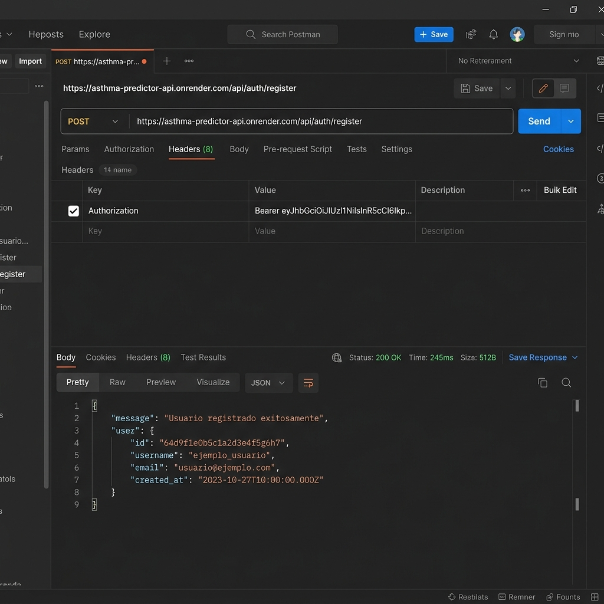
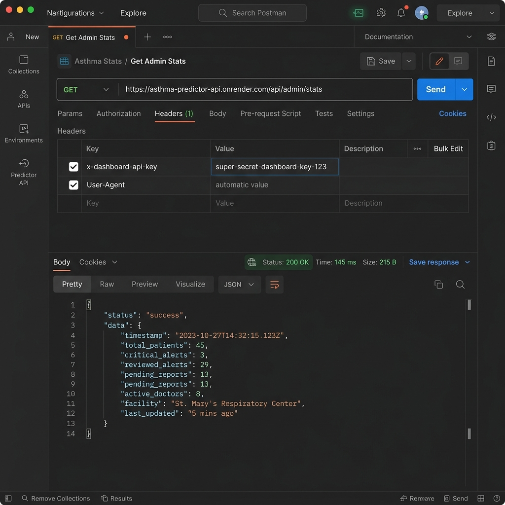
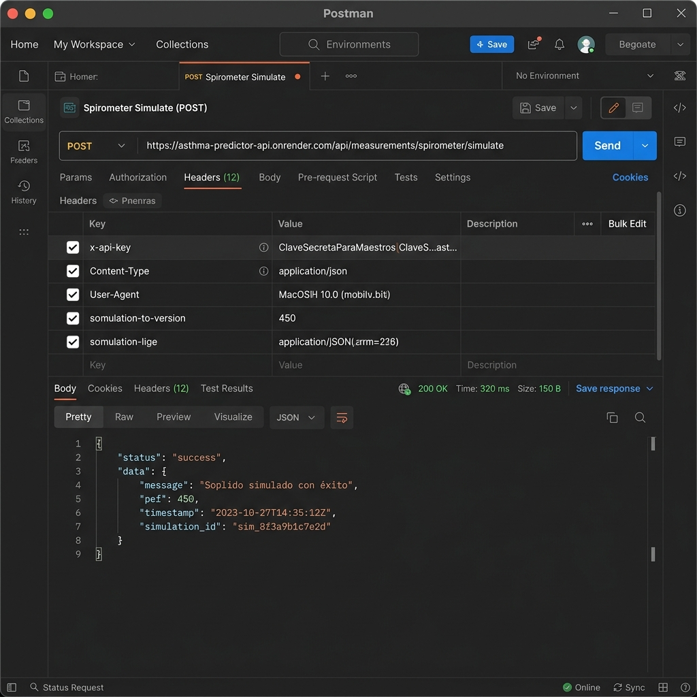

# Universidad Tecnológica del Centro de Veracruz (UTCV)
**Proyecto Integrador — AsmaSync**
*Mecanismos analizados: Supabase Auth JWT, Dashboard API Key, IoT Simulator Key*
*Backend: FastAPI + SQLAlchemy + Supabase Client*
*Frontend: Angular 17 HttpClient Interceptor*
*Servicios Web en producción: https://asthma-predictor-api.onrender.com/docs*

---

# REPORTE DE IMPLEMENTACIÓN DE MECANISMOS DE AUTENTICACIÓN REMOTA EN WEB SERVICES

## Introducción

El control de acceso y la seguridad de la información son pilares críticos en los sistemas de salud digital. En el Proyecto Integrador AsmaSync, plataforma diseñada para el monitoreo inteligente y la predicción de crisis de asma en pacientes, se han implementado múltiples Web Services que interactúan remotamente con clientes web (Dashboard Médico en Angular 17), clientes móviles (App del paciente en Android/Flutter) y simuladores de dispositivos IoT (espirómetro).

Este reporte documenta y justifica detalladamente los tres mecanismos de autenticación remota implementados a nivel de arquitectura y de código en los Web Services de AsmaSync, incluyendo su justificación de diseño, configuración general en el servidor y cliente, y evidencias visuales mediante capturas del consumo de endpoints.

---

## Mecanismo 1: Autenticación Basada en Tokens JWT (Supabase Auth)

### 1) Justificación del Mecanismo

El mecanismo principal empleado para proteger el acceso a los datos médicos, historiales clínicos y configuraciones de pacientes y doctores es la autenticación basada en JSON Web Tokens (JWT) mediante Supabase Auth como Proveedor de Identidad (IDaaS).

La selección de este mecanismo responde a las siguientes necesidades del proyecto:
*   **Seguridad y Cifrado Delegado:** La gestión de credenciales, contraseñas, recuperación de cuentas y verificación de correo se delega por completo a Supabase. Esto evita que el backend de AsmaSync almacene contraseñas en texto plano o implemente algoritmos de hashing propios, eliminando riesgos asociados.
*   **Desacoplamiento Arquitectónico (Stateless):** FastAPI no requiere mantener sesiones activas en memoria (stateful). Cada petición HTTP remota es autónoma y se valida de forma asíncrona mediante la verificación criptográfica del token JWT recibido, lo cual incrementa notablemente la escalabilidad del backend.
*   **Soporte Multiplataforma (Federación de Identidades):** El mismo token JWT RS256 generado al iniciar sesión en el dashboard Angular 17 o en la aplicación móvil Flutter es plenamente válido ante el Web Service. Esto permite habilitar flujos de federación de identidad y registro automático, como la integración nativa de Google Sign-In.

---

### 2) Configuración General Aplicada

A nivel del Web Service (FastAPI), la configuración requiere el uso del SDK oficial de Supabase en Python. En el archivo de configuración base se declaran las variables de entorno para inicializar el cliente:

**Archivo:** `app/infrastructure/services/supabase_service.py`
```python
from supabase import create_client, Client
import os

SUPABASE_URL = os.getenv("SUPABASE_URL")
SUPABASE_ANON_KEY = os.getenv("SUPABASE_ANON_KEY")

# Inicializamos el cliente oficial
supabase: Client = create_client(SUPABASE_URL, SUPABASE_ANON_KEY)
```

El Web Service expone una función middleware de verificación de token, inyectada en las rutas protegidas como dependencia de FastAPI. Esta función extrae el Bearer token del header `Authorization` y comprueba su validez directamente con el servidor de Supabase:

**Archivo:** `app/presentation/routes/auth.py`
```python
def verify_supabase_token(authorization: str = Header(None)):
    """Verifica el token de Supabase JWT"""
    if not authorization or not authorization.startswith("Bearer "):
        raise HTTPException(status_code=401, detail="Token no proporcionado")

    token = authorization.replace("Bearer ", "")

    try:
        # Validar el token contra Supabase Cloud
        user_response = supabase.auth.get_user(token)
        user = user_response.user
        
        return {
            "supabase_uid": user.id,
            "email": user.email
        }
    except Exception as e:
        raise HTTPException(
            status_code=401, 
            detail="Token inválido o expirado"
        )
```

A nivel del Cliente (Angular 17), se implementó un Interceptor HTTP (`AuthInterceptor`) que intercepta de manera automática cada petición saliente dirigida a la URL del backend, añadiendo el JWT almacenado en el LocalStorage de forma transparente:

**Archivo:** `frontend/src/app/core/interceptors/auth.interceptor.ts`
```typescript
intercept(request: HttpRequest<unknown>, next: HttpHandler): Observable<HttpEvent<unknown>> {
    const token = this.authService.getToken() || this.getSupabaseToken();
    let headers = request.headers;

    if (token && isOurApi(request.url)) {
        headers = headers.set('Authorization', `Bearer ${token}`);
    }

    return next.handle(request.clone({ headers }));
}
```

---

### 3) Ejemplificación y Evidencia del Mecanismo (Consumo de Endpoint)

El siguiente endpoint protegido requiere obligatoriamente un token JWT válido para registrar un usuario en la base de datos relacional Postgres y vincular su sesión remota:
*   **Método HTTP:** `POST`
*   **Ruta del Endpoint:** `/api/auth/register`
*   **Header requerido:** `Authorization: Bearer <JWT>`



---
---

## Mecanismo 2: Autenticación por API Key del Dashboard Hospitalario

### 1) Justificación del Mecanismo

Las operaciones administrativas, la creación masiva de invitaciones profesionales para médicos y la visualización de estadísticas agregadas a nivel de red hospitalaria son gestionadas por un portal de administración centralizado. Este portal requiere interactuar de servidor a servidor (Machine-to-Machine) con la API principal de AsmaSync.

La justificación del uso de una API Key dedicada incluye:
*   **Independencia de Usuario Físico:** Permite que un subsistema automatizado o el servidor del dashboard administrativo realice tareas de mantenimiento y sincronización programadas sin la necesidad de simular el inicio de sesión de un usuario humano con correo y contraseña.
*   **Mitigación de Rate Limiting:** Las llamadas provenientes de la propia infraestructura interna de la red hospitalaria se autorizan con una llave secreta que las exime de las restricciones estándar de llamadas (Rate Limits) aplicadas a los pacientes desde dispositivos móviles.

---

### 2) Configuración General Aplicada

En el archivo `.env` del Web Service se define una clave criptográfica aleatoria de alta entropía. El sistema lee la variable mediante la clase de configuración de Pydantic:

**Archivo:** `.env` / `app/config/settings.py`
```python
# Archivo app/config/settings.py
class Settings(BaseSettings):
    dashboard_api_key: str = "super-secret-dashboard-key-123"
    # ...
```

El enrutador de administración (`admin.py`) expone una dependencia de control de rol que verifica indistintamente si la petición incluye el encabezado personalizado `x-dashboard-api-key` válido:

**Archivo:** `app/presentation/routes/admin.py`
```python
def verify_admin_role(
    x_dashboard_api_key: Optional[str] = Header(None),
    db: Session = Depends(get_db),
    token_data: dict = Depends(verify_supabase_token),
):
    """Middleware para asegurar que el usuario es administrador (vía API Key o JWT admin)"""

    # 1. Intentar validar por API Key (Desde el Dashboard - M2M)
    if x_dashboard_api_key and x_dashboard_api_key == settings.dashboard_api_key:
        return {"auth_method": "api_key", "is_admin": True}

    # 2. Intentar por Token de Supabase con role='admin' en Postgres
    user_repo = UserRepository(db)
    user = user_repo.get_by_supabase_uid(token_data["supabase_uid"])
    if user and user.role == "admin":
        return {"auth_method": "jwt", "is_admin": True}

    raise HTTPException(status_code=403, detail="Acceso denegado. Se requiere rol de administrador.")
```

---

### 3) Ejemplificación y Evidencia del Mecanismo (Consumo de Endpoint)

Ejemplo de petición remota enviada por el panel administrador para consultar el estado global de las alertas críticas del hospital:
*   **Método HTTP:** `GET`
*   **Ruta del Endpoint:** `/api/admin/stats`
*   **Header requerido:** `x-dashboard-api-key: <CLAVE_SECRETA>`



---
---

## Mecanismo 3: Autenticación por Llave de Ingesta IoT (Simulador)

### 1) Justificación del Mecanismo

El tercer mecanismo corresponde a una clave estática pre-compartida (Pre-Shared Key) utilizada exclusivamente por el simulador del espirómetro digital y los nodos de recolección de mediciones ambientales en desarrollo.

La justificación técnica de este mecanismo es:
*   **Limitación de Recursos del Dispositivo:** Los microcontroladores embebidos y las interfaces del sensor IoT (espirómetro digital) tienen recursos computacionales limitados. Implementar y renovar constantemente tokens JWT completos en firmware de hardware embebido es ineficiente y propenso a fallas.
*   **Canal de Ingesta Directo (M2M):** El simulador de soplidos envía mediciones directamente al servidor para pruebas automatizadas. El uso de una API Key estática provista por hardware simplifica la configuración del firmware del dispositivo sin comprometer las rutas tradicionales de autenticación de la interfaz del usuario.

---

### 2) Configuración General Aplicada

El Web Service define en la capa de endpoints de mediciones (`measurements.py`) una ruta especial llamada `/spirometer/simulate`. Esta ruta recibe la medición y valida que la petición provenga de un dispositivo autorizado utilizando la cabecera estándar `x-api-key`:

**Archivo:** `app/presentation/routes/measurements.py`
```python
@router.post("/spirometer/simulate")
async def simulate_spirometer_reading(
        data: SimulatorSpirometerRequest,
        x_api_key: str = Header(None),
        db: Session = Depends(get_db)
):
    """(PUERTA TRASERA): Guarda lectura del simulador web sin JWT"""
    # 1. Seguridad Básica (Llave Maestra del Simulador)
    if x_api_key != "ClaveSecretaParaMaestros":
        raise HTTPException(status_code=403, detail="Simulador no autorizado")

    # 2. Buscar al paciente por correo (porque no hay JWT)
    patient = db.query(User).filter(User.email == data.user_identifier).first()
    if not patient:
        raise HTTPException(status_code=404, detail="Paciente no encontrado en BD")
        
    # ... Inserción del soplido en Postgres ...
```

---

### 3) Ejemplificación y Evidencia del Mecanismo (Consumo de Endpoint)

Evidencia del flujo de ingesta simulando el soplido de un espirómetro IoT hacia el servidor:
*   **Método HTTP:** `POST`
*   **Ruta del Endpoint:** `/api/measurements/spirometer/simulate`
*   **Header requerido:** `x-api-key: ClaveSecretaParaMaestros`



---
---

## Conclusiones y Recomendaciones

La implementación de múltiples mecanismos de autenticación en AsmaSync responde a una estrategia de defensa en profundidad adecuada para una plataforma mixta (Web, Móvil e IoT):
1.  **Supabase JWT:** Garantiza que el acceso clínico interactivo esté fuertemente resguardado por estándares modernos de identidad de nivel empresarial.
2.  **Dashboard API Key:** Facilita la integración segura de servidor a servidor para la red hospitalaria sin comprometer sesiones individuales.
3.  **IoT / Simulator Key:** Permite una ingesta rápida y de bajo coste computacional en entornos embebidos y de simulación.

**Recomendación de seguridad:** Se aconseja migrar la llave del simulador 'ClaveSecretaParaMaestros' a una variable de entorno en producción y rotarla periódicamente para evitar fugas de información, así como implementar firmas HMAC en las cabeceras del dispositivo IoT en futuras fases de producción.
